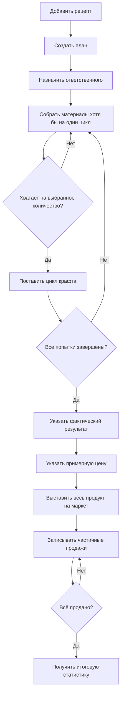

# Крафты Товарищества

Система крафтов помогает провести весь производственный цикл в одном месте: подготовить рецепт, собрать материалы, поставить партии в производство, сверить склад, выставить готовый продукт на маркет и записать продажи.

Бот сам считает материалы и время, напоминает о следующем цикле, обновляет общую карточку и сохраняет подробную историю действий.

## Где находится система

Карточки планов, напоминания, ветки и итоги находятся в **«Мастерской»**
(`1526606361369116672`). Живая сводка в **«Активных задачах»** показывает состояние и ведёт
прямой ссылкой на единственную карточку в мастерской.

Открыть крафты можно через `/tvrs` → **«Крафты»** в любом серверном канале или прямой командой
`/craft` в любом серверном канале. Меню видит только вызвавший его участник, а новая общая карточка всегда
публикуется в мастерской. Обычные рабочие кнопки доступны всем участникам с доступом к
карточке. Примерную цену и выставление на маркет отмечает ответственный за план либо администратор.

Финансовые снятия и пополнения выполняются через `/finance` в любом серверном канале либо через `/tvrs` → **«Казна»**.

## Весь путь крафта



## Меню `/craft`

Введите `/craft` в любом серверном канале либо откройте `/tvrs` → **«Крафты»**. Бот покажет личное меню с тремя разделами:

| Кнопка | Для чего она нужна |
|---|---|
| **Текущие крафты** | Посмотреть незавершённые планы и перейти к их карточкам |
| **Новый план** | Выбрать рецепт, количество попыток и ответственного |
| **Рецепты** | Посмотреть существующие рецепты или добавить новый |

Само меню видите только вы. Созданная карточка плана публикуется в общем канале и видна всем.

## Рецепты

Рецепт описывает, что требуется для одной попытки крафта.

Для каждого рецепта указываются:

- название готового продукта;
- расход казны на одну единицу;
- длительность крафта одной единицы в минутах;
- максимальное количество единиц за один цикл;
- материалы и их количество на одну единицу.

### Как добавить рецепт

1. Вызовите `/craft`.
2. Нажмите **«Рецепты»**.
3. Нажмите **«Добавить рецепт»**.
4. Заполните все поля.
5. Подтвердите форму.

Материалы вводятся по одному на строку в формате:

```text
Название: количество
```

Например:

```text
Железная руда: 50
Серебряная руда: 30
Медная руда: 15
Оловянная руда: 5
```

Для промышленных металлов рецепт может выглядеть так:

```text
Продукт: Промышленные металлы
Расход казны на 1 единицу: 1 000
Время на 1 единицу: 10 минут
Максимум за цикл: 10
```

> [!WARNING]
> Рецепт применяется ко всему новому плану. Перед сохранением особенно внимательно проверьте время, максимальный размер цикла и количество каждого материала.

### Как управлять рецептами

1. Вызовите `/craft`.
2. Нажмите **«Рецепты»**.
3. Нажмите **«Управление рецептами»**.
4. Выберите рецепт. При большом списке используйте **«Назад»** и **«Далее»**.

В карточке управления доступны:

- **«Изменить»** — исправить название, расход казны, время, размер цикла или материалы;
- **«Копировать»** — создать новый рецепт на основе существующего;
- **«Включить / отключить»** — скрыть рецепт из списка новых планов без удаления истории;
- **«Версии»** — посмотреть историю изменений.

Изменение рецепта не меняет уже созданные планы. Старый план продолжит работать по той версии, с которой был создан. Новые планы получат новую версию.

После изменения бот показывает ID действия. Ошибочную правку можно отменить через `/undo action_id:...` — восстановление тоже становится новой версией, поэтому история остаётся полной.

## Создание плана

План — это конкретная производственная задача по выбранному рецепту.

### Как создать план

1. Вызовите `/craft`.
2. Нажмите **«Новый план»**.
3. Выберите рецепт. Если рецептов много, переключайте страницы кнопками **«Назад»** и **«Далее»**.
4. Укажите количество попыток.
5. Вставьте упоминание или Discord ID ответственного.
6. Подтвердите форму.

После этого бот:

- создаст общую карточку плана;
- рассчитает материалы на весь объём;
- назначит ответственного;
- создаст ветку с подробным журналом;
- откроет стадию закупки.

### Как бот считает материалы

Количество из рецепта умножается на количество попыток.

Для 100 попыток примера выше потребуется:

| Материал | На 1 попытку | На 100 попыток |
|---|---:|---:|
| Железная руда | 50 | 5 000 |
| Серебряная руда | 30 | 3 000 |
| Медная руда | 15 | 1 500 |
| Оловянная руда | 5 | 500 |

Считать это вручную не нужно.

## Общая карточка плана

Карточка всегда показывает актуальное состояние крафта:

- текущую стадию;
- ответственного и создателя плана;
- сколько попыток запланировано, поставлено и завершено;
- материалы и остаток на складе;
- текущий цикл и время его завершения;
- полученный продукт;
- выставленное и проданное количество;
- выручку и среднюю цену.

Кнопки меняются вместе со стадией. Если действие больше не подходит, бот убирает соответствующую кнопку.

Под карточкой создаётся ветка. Это журнал плана — удалять её не следует.

## Закупка материалов

На стадии закупки под карточкой появляются отдельные кнопки **«Добавить …»** для недостающих материалов.

Кнопку может нажать любой участник канала.

### Как записать закупку

1. Нажмите кнопку нужного материала.
2. Укажите количество купленного материала.
3. Укажите общую стоимость всей партии.
4. Если деньги снимались через `/finance`, укажите полученный четырёхбуквенный код.
5. Подтвердите форму.

Бот добавит материал на склад и пересчитает остаток.

В ветке появятся:

- автор закупки;
- материал;
- количество;
- общая стоимость;
- средняя цена одной единицы;
- сколько ещё осталось собрать;
- наличие или отсутствие связи с финансовой операцией.

### Как связать закупку с финансами

Если для закупки вы берёте деньги из казны:

1. Нажмите **«Казна»** в панели управления или вызовите `/finance` в текущем канале.
2. Нажмите **«Снял»**.
3. Укажите точную общую стоимость закупаемой партии и подробную причину.
4. Введите капчу.
5. Получите код из четырёх букв.
6. Проведите игровую операцию с этим кодом.
7. Вернитесь к карточке крафта.
8. Введите тот же код в поле закупки.

Сумма закупки должна точно совпадать с суммой снятия. Один финансовый код можно связать только с одной закупкой.

> [!NOTE]
> Поле кода необязательное, потому что партия могла быть получена бесплатно или оплачена не из казны. Без кода бот сохранит закупку, но отметит, что финансовая связь не подтверждена.

> [!NOTE]
> Связанное с крафтом снятие нельзя отменить раньше самой закупки. Если в закупке допущена ошибка, отмените её действие, а затем при необходимости отмените финансовое снятие.

## Частичный переход к производству

Не нужно ждать закупки материалов на весь план. Как только каждого материала хватает хотя бы на
одну попытку, карточка разрешает поставить цикл. Быстрая большая кнопка показывает максимум по
текущему складу, остатку плана и ограничению рецепта.

Например, для плана из 100 попыток материалы собраны только на 3. Можно поставить цикл на 1, 2
или 3 попытки. Бот спишет материалы только на выбранное количество. Во время активного цикла
участники могут продолжать пополнять материалы для следующих.

Первый запуск автоматически переводит план в **«Производство»**. После каждого запуска карточка
считает потребность только для ещё не поставленных попыток.

> [!WARNING]
> Пользовательское количество нельзя поставить выше фактического запаса, остатка плана или
> максимального размера цикла из рецепта.

## Производственные циклы

На стадиях закупки и производства доступны быстрые кнопки, как только материалов хватает:

- **«Поставил 1 шт.»**;
- **«Поставил N шт.»**, где N — максимум по текущему запасу, остатку плана и рецепту;
- **«Другое количество»**.

Поставить цикл может любой участник канала.

### Как поставить цикл

1. Сначала поставьте нужное количество в игре.
2. Сразу нажмите соответствующую кнопку в Discord.
3. Проверьте время окончания, которое покажет бот.

После запуска бот:

- спишет со склада материалы на выбранное количество;
- запишет расход казны по рецепту;
- рассчитает время завершения;
- заблокирует запуск ещё одного цикла до окончания текущего;
- сохранит автора и все данные в журнале.

Расход казны на производство создаётся автоматически. Отдельно нажимать **«Снял»** в `/finance` для этой суммы не нужно.

Такой автоматический расход нельзя отменить отдельно от цикла. При отмене действия запуска цикла бот одновременно возвращает расчётные материалы и автоматический расход казны.

### Пример времени

Если одна единица крафтится 10 минут:

| Поставлено | Время цикла |
|---:|---:|
| 1 шт. | 10 минут |
| 5 шт. | 50 минут |
| 10 шт. | 100 минут |

Для партии из 10 единиц следующий цикл можно ставить через 100 минут.

> [!IMPORTANT]
> Нажимайте кнопку только после того, как цикл действительно поставлен в игре. Бот сразу спишет материалы и расход казны.

## Напоминания о следующем цикле

Если предыдущий цикл завершился, а новый ещё не поставлен, бот начинает напоминать:

| Просрочка | Что делает бот |
|---:|---|
| 10 минут | Обычное напоминание |
| 30 минут | Напоминание с `@everyone` |
| 60 минут | Обычное напоминание |
| 120 минут | Напоминание с `@everyone` |
| Далее каждый час | Чередует обычное сообщение и `@everyone` |

С `02:00` до `09:00` по времени бота напоминания не отправляются. После окончания ночного периода система продолжит напоминать по текущей просрочке.

Когда участник ставит следующий цикл, бот удаляет отправленные напоминания, чтобы канал оставался чистым.

## Сверка склада

Кнопка **«Сверка склада»** доступна на всех рабочих стадиях плана.

Она нужна, если:

- в игре количество отличается от карточки;
- материалы были получены или потеряны вне обычной закупки;
- необходимо проверить остатки перед новым циклом;
- нужно подтвердить количество готового продукта.

### Как провести сверку

1. Нажмите **«Сверка склада»**.
2. В готовом шаблоне укажите фактическое количество каждого материала.
3. Укажите фактическое количество готового продукта.
4. При необходимости оставьте комментарий.
5. Подтвердите форму.

Не удаляйте строки материалов из шаблона. Бот ожидает значение для каждого материала плана.

Пример:

```text
Железная руда = 4 500
Серебряная руда = 2 700
Медная руда = 1 350
Оловянная руда = 450
```

Сверка заменяет расчётные значения фактическими и полностью записывается в ветку.

> [!WARNING]
> Сверка — не способ добавить закупку без истории. Для обычной покупки используйте кнопку конкретного материала. Сверку применяйте именно для проверки и исправления фактического склада.

## Завершение производства

Когда завершатся все запланированные попытки, бот сменит стадию на итоговую сверку.

Нажмите **«Указать результат»** и введите фактическое количество полученного продукта на складе.

Количество может быть меньше числа попыток, если часть крафтов оказалась неуспешной. Оно не может быть больше количества завершённых попыток.

После подтверждения бот посчитает процент успешности и упомянет ответственного за план.

Если получено `0`, план завершится без стадии продаж, а итог всё равно попадёт в общий журнал.

## Подготовка к маркету

Ответственный за план или администратор выполняет два действия:

1. Нажимает **«Цена за 1 шт.»** и указывает примерную цену продажи.
2. Нажимает **«Выставил на маркет»** и указывает фактически выставленное количество.

Выставлять продукт можно несколькими партиями. Бот будет показывать, сколько ещё осталось выставить.

Стадия продаж откроется только после того, как на маркет будет выставлен весь фактически полученный продукт.

Это защищает план от преждевременного учёта продаж при наличии товара на складе.

## Запись продаж

Когда весь продукт выставлен, появится кнопка **«Записать продажу»**.

Её может использовать любой участник канала, который проверил данные маркета.

### Как записать частичную продажу

1. Нажмите **«Записать продажу»**.
2. Укажите количество проданных предметов.
3. Укажите общую сумму, полученную за эту часть.
4. Подтвердите форму.

Продажу не обязательно вводить одной записью. Например, для 90 предметов можно последовательно записать:

```text
30 шт. за 3 750 000
20 шт. за 2 400 000
40 шт. за 4 800 000
```

После каждой записи бот покажет:

- сколько продано сейчас;
- сумму текущей продажи;
- сколько осталось продать;
- общую выручку;
- среднюю цену продажи.

## Пополнение казны после продажи

После каждой записанной продажи бот покажет личную кнопку **«Открыть казну»**.

Если деньги уже внесены в казну:

1. Нажмите личную кнопку **«Открыть казну»** или вызовите `/finance` в текущем канале.
2. Нажмите **«Положил»**.
3. Укажите сумму именно этой продажи.
4. Подробно опишите источник, например: `Продажа промышленных металлов, план крафта #7`.
5. Введите капчу.
6. Перенесите полученный код в игру.

Бот не вносит выручку в казну автоматически, потому что сначала деньги должны действительно появиться после продажи.

## Завершение плана

Когда продано всё фактическое количество, план закрывается автоматически.

В общий канал отправляется итоговая карточка со статистикой:

- сколько попыток было запланировано и завершено;
- сколько продукта удалось получить;
- процент успешности;
- общая стоимость закупок;
- расход казны на производство;
- сколько предметов продано;
- общая выручка;
- средняя цена продажи;
- итоговый финансовый результат.

Исходная карточка становится зелёной, рабочие кнопки исчезают, а ветка остаётся доступной как полный журнал.

## Что записывается в журнал

В ветке карточки сохраняются:

- создание плана;
- каждая закупка;
- переход к производству;
- каждая сверка склада;
- запуск и завершение каждого цикла;
- итоговое количество продукта;
- примерная цена;
- каждое выставление на маркет;
- каждая частичная продажа.
- каждая отмена с автором, причиной и номером исходного действия.

Для действий участников указываются автор и время. Для закупок и продаж бот дополнительно считает среднюю цену.

## Кто что может делать

| Действие | Кто может выполнить |
|---|---|
| Открыть `/craft` | Любой участник канала |
| Добавить рецепт | Любой участник канала |
| Создать план | Любой участник канала |
| Записать закупку | Любой участник канала |
| Поставить цикл | Любой участник канала |
| Провести сверку склада | Любой участник канала |
| Указать итог производства | Любой участник канала |
| Указать цену | Ответственный, финансовый администратор или администратор сервера |
| Отметить выставление | Ответственный, финансовый администратор или администратор сервера |
| Записать продажу | Любой участник канала |
| Изменить, копировать или отключить рецепт | Любой участник канала |
| Отменить своё действие | Автор действия |
| Отменить чужое действие | Финансовый администратор или администратор сервера |

## Как исправить ошибку

После закупки, сверки склада, запуска цикла, ввода результата, цены, выставления или продажи бот показывает **ID действия**.

Для точечной отмены используйте:

```text
/undo action_id:184 reason:По ошибке указал 10 вместо 1
```

Если ID потерялся:

```text
/actions module:craft
```

Бот отменяет связанные расчёты целиком:

- закупка убирается из расчётного склада и стоимости;
- сверка возвращает предыдущие значения склада;
- цикл возвращает материалы, попытки и автоматический расход казны;
- результат возвращает план к итоговой сверке;
- выставление и продажа возвращают предыдущие количества;
- отмена создания плана переводит его в состояние **«Отменён»**.

Если после ошибочного действия уже есть зависимые записи, бот назовёт более поздний ID. Отменяйте цепочку с конца к началу.

> [!WARNING]
> Бот исправляет журнал и расчётный склад. Он не может убрать поставленный крафт, товар с маркета или вернуть предметы внутри игры. После `/undo` обязательно синхронизируйте фактическое состояние в игре.

## Статистика крафтов

В любом серверном канале введите:

```text
/craft-stats days:30
```

Отчёт показывает:

- активные, завершённые и отменённые планы;
- запланированные и завершённые попытки;
- полученный продукт и успешность;
- продажи, выручку, закупки и расходы казны;
- расчётный результат;
- количество циклов и среднюю задержку;
- статистику по рецептам и участникам.

Отменённые закупки, циклы и продажи в суммы не входят.

## Частые ситуации

### Кнопка материала исчезла

Требуемое количество этого материала уже собрано. Посмотрите актуальный остаток в карточке.

### Код из `/finance` не принимается

Проверьте четыре условия:

- код состоит ровно из четырёх букв;
- использован код снятия, а не пополнения;
- сумма снятия точно равна стоимости партии;
- код ещё не был связан с другой закупкой.

### Бот не даёт поставить цикл

Возможные причины:

- предыдущий цикл ещё идёт;
- не хватает материалов на выбранное количество;
- превышен максимум рецепта;
- выбранное количество больше остатка плана;
- нет точного исходного отчёта казны;
- расчётного остатка казны недостаточно.

Если неизвестен остаток казны, проведите вечерний отчёт или **«Межотчёт»** через `/finance`.

### Я нажал не ту кнопку цикла

Найдите ID запуска в ответе бота или через `/actions module:craft` и выполните `/undo action_id:...`. Бот вернёт расчётные материалы, попытки и расход казны. Если цикл уже был поставлен в игре, отдельно сообщите ответственному и исправьте фактическое состояние.

### Время завершения прошло, но карточка ещё показывает цикл

Подождите до 30 секунд и обновите Discord. Бот регулярно проверяет завершение циклов.

### Материалы в игре и карточке различаются

Проведите **«Сверку склада»** и укажите фактические значения по всем строкам.

### Получилось меньше продукта, чем было попыток

Это нормальная ситуация. На этапе результата укажите фактическое количество — бот сам рассчитает успешность.

### На маркет выставили только часть

Запишите эту часть кнопкой **«Выставил на маркет»**. Кнопка останется доступной, пока не будет выставлен весь продукт.

### Продалась только часть партии

Запишите только фактическое количество и фактическую сумму. Остаток можно внести следующей продажей позднее.

### Напоминания пришли ночью

Проверьте часовой пояс `LOCAL_TIMEZONE` у администратора бота. Тихий период считается по времени бота.

## Памятка участника

```text
Нужен новый вид продукта
→ /craft → Рецепты → Добавить рецепт

Начинаем производство
→ /craft → Новый план → рецепт → попытки → ответственный

Купил материал
→ при необходимости /finance → Снял
→ карточка крафта → Добавить материал → количество → стоимость → код

Поставил крафт в игре
→ сразу нажал «Поставил 1/N шт.»

Нашёл расхождение склада
→ Сверка склада

Все попытки закончились
→ Указать результат

Ответственный выставляет товар
→ Цена за 1 шт. → Выставил на маркет

Появилась продажа
→ Записать продажу
→ /finance → Положил фактическую выручку
```

Главное правило: **сначала выполняйте действие в игре, затем сразу фиксируйте его подходящей кнопкой бота и не подменяйте закупку или продажу сверкой склада**.
