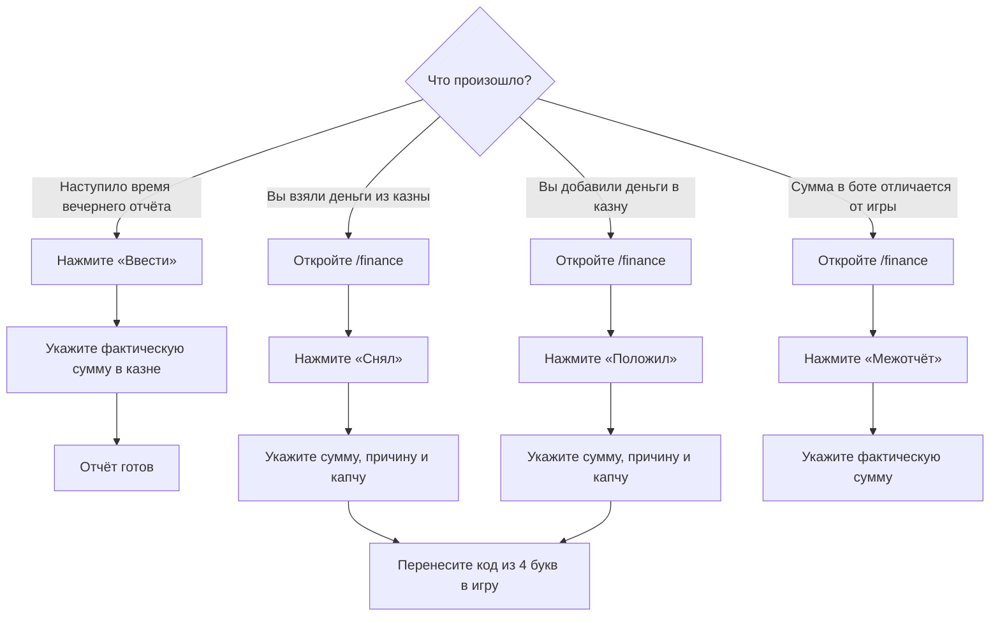

# Финансы Товарищества

Система финансов помогает участникам следить за казной, отмечать снятие и пополнение денег и регулярно сверять фактический остаток.

Вам не нужно вести расчёты вручную. Достаточно вовремя выбирать нужное действие и указывать правдивую сумму.

## Как всё устроено



## Где пользоваться системой

| Что нужно сделать | Где это происходит |
|---|---|
| Заполнить вечерний отчёт | Канал отчётов казны `1526006974502670558` |
| Снять или положить деньги | `/tvrs` → **«Казна»** в любом серверном канале или `/finance` в канале `1521266302889754747` |
| Провести внеплановую сверку | Кнопка **«Межотчёт»** в разделе казны |

Разделом казны может пользоваться любой участник. Прямая команда `/finance` остаётся быстрым
путём и работает только в финансовом канале; универсальное меню `/tvrs` можно открыть в любом
серверном канале.

## Как понимать сумму в `/finance`

Панель показывает **примерный остаток** казны.

Он считается так:

```text
Последняя проверенная сумма
+ отмеченные пополнения
− отмеченные снятия
= примерный остаток
```

Например:

```text
Вечерний отчёт:  10 000 000 $
Положили:           500 000 $
Сняли:              200 000 $

Примерно в казне: 10 300 000 $
```

> [!NOTE]
> Сумма называется примерной, потому что игра может списывать деньги на технические расходы. Такие списания бот не видит.

Если сумма в `/finance` отличается от реальной казны, не пытайтесь исправлять разницу выдуманным снятием или пополнением. Используйте **«Межотчёт»**.

## Ежедневный отчёт

Каждый день в `18:00` бот просит участников проверить казну.

В канале появляется сообщение:

> **🏛️ Ежедневная сверка казны**  
> Настало время зафиксировать фактический остаток казны за сегодняшний день.
>
> **Статус:** 🟡 Ожидает заполнения
>
> Кнопка: `Ввести`

### Кто может заполнить отчёт

Отчёт может заполнить любой участник, который видит сообщение и может проверить фактическую сумму в казне.

Не нужно ждать определённого человека. Если вы уверены в сумме, можете заполнить отчёт самостоятельно.

### Как заполнить

1. Проверьте фактическую сумму казны в игре.
2. Нажмите **«Ввести»** под сообщением бота.
3. Впишите полную сумму.
4. Ещё раз сравните число с игрой.
5. Подтвердите форму.

Сумму можно писать разными способами:

```text
12500000
12 500 000
12.500.000
12,500,000
```

После заполнения сообщение изменится:

> **✅ Ежедневная сверка казны заполнена**  
> **В казне:** `12 500 000 $`  
> **Заполнил:** @User

Кнопка станет неактивной. Повторно заполнять тот же вечерний отчёт не нужно.

> [!WARNING]
> Не вводите приблизительную сумму. Вечерний отчёт должен содержать фактический остаток, который вы видите в игре.

## Панель `/finance`

Введите `/finance` в финансовом канале.

Бот покажет приватную панель:

> **💼 Финансы Товарищества**  
> **Примерно в казне:** `10 300 000 $`  
> **Последняя точная сверка:** `10 000 000 $`  
> **Операций после сверки:** `2`
>
> Кнопки: `Снял` · `Положил` · `Межотчёт`

Панель видна только вам. Остальные участники не увидят её в канале.

## Если вы сняли деньги

Используйте кнопку **«Снял»**, если вы действительно взяли деньги из казны.

### Порядок действий

1. Введите `/finance`.
2. Нажмите **«Снял»**.
3. Укажите сумму снятия.
4. Подробно опишите причину.
5. Перепишите три цифры из подсказки в поле капчи.
6. Подтвердите форму.
7. Получите код из четырёх букв.
8. Введите этот код в причину операции в игре.

### Пример заполнения

```text
Сумма
750 000

Подробная причина
Закупка и подготовка транспорта для общего мероприятия Товарищества

Проверка: перепишите 3 цифры
482
```

После подтверждения бот ответит:

> **✅ Операция записана**  
> Зафиксировано снятие на `750 000 $`.
>
> **Код из 4 букв:** `KXRM`

В игре причина может выглядеть так:

```text
KXRM
```

Если игра позволяет написать более длинную причину, код всё равно должен присутствовать в ней без изменений.

## Если вы положили деньги

Используйте кнопку **«Положил»**, если вы добавили деньги в казну.

Порядок действий такой же:

1. Введите `/finance`.
2. Нажмите **«Положил»**.
3. Укажите внесённую сумму.
4. Подробно опишите источник денег.
5. Введите капчу из трёх цифр.
6. Подтвердите форму.
7. Перенесите полученный четырёхбуквенный код в причину операции в игре.

Пример причины:

```text
Поступление членских взносов за текущий период от трёх участников
```

После операции примерный остаток в `/finance` увеличится.

## Как правильно писать причину

Причина должна помогать другому участнику понять, куда ушли деньги или откуда они появились.

### Хорошие причины

```text
Закупка двух автомобилей для мероприятия 14 июля

Возврат остатка после организации общего собрания

Поступление членских взносов от участников за июль

Оплата материалов для оформления офиса Товарищества
```

### Плохие причины

```text
надо

машина

расходы

потом объясню
```

Плохая причина не объясняет назначение операции и затрудняет последующую проверку.

> [!TIP]
> Хорошая причина отвечает минимум на два вопроса: **для чего** нужны деньги и **с чем связана** операция.

## Капча из трёх цифр

При снятии и пополнении в последнем поле формы показываются три цифры.

Например:

```text
Проверка: перепишите 3 цифры
Код: 482
```

В поле нужно написать:

```text
482
```

Капча защищает от случайного подтверждения формы.

Если цифры введены неверно:

- операция не сохраняется;
- деньги в расчёте не изменяются;
- нужно снова нажать **«Снял»** или **«Положил»**;
- в новой форме будет другая капча.

## Код из четырёх букв

После успешного снятия или пополнения бот выдаёт случайный код:

```text
KXRM
```

Этот код необходимо перенести в причину операции в игре. Он нужен для связи игровой операции с записью в Discord.

Правила:

- используйте именно тот код, который выдал бот;
- не меняйте порядок букв;
- не используйте код от старой операции;
- не закрывайте ответ бота, пока не перенесёте код в игру;
- для каждой операции создаётся новый код.

> [!WARNING]
> Если вы подтвердили форму, но не провели операцию в игре, сразу сообщите ответственному за казну. Не создавайте обратную фиктивную операцию без согласования.

## Межотчёт

**Межотчёт** — это внеплановая проверка фактической суммы в казне.

Он нужен, если:

- сумма в `/finance` отличается от суммы в игре;
- после технических расходов расчёт устарел;
- необходимо проверить казну до вечернего отчёта;
- ответственному участнику нужна точная сумма прямо сейчас.

### Как провести межотчёт

1. Проверьте фактическую сумму в игре.
2. Введите `/finance`.
3. Нажмите **«Межотчёт»**.
4. Укажите фактическую сумму.
5. Проверьте число ещё раз.
6. Подтвердите форму.

После межотчёта указанная сумма становится новой точной суммой. Все последующие снятия и пополнения будут считаться уже от неё.

Капча и код из четырёх букв для межотчёта не нужны, потому что вы не перемещаете деньги, а только сверяете остаток.

## Как выбрать нужную кнопку

| Ситуация | Что нажать |
|---|---|
| Взяли деньги из казны | **«Снял»** |
| Добавили деньги в казну | **«Положил»** |
| Проверили казну и нашли расхождение | **«Межотчёт»** |
| Наступило время ежедневного отчёта | **«Ввести»** в сообщении отчёта |
| Только хотите посмотреть примерную сумму | Вызвать `/finance`, ничего не нажимать |

## Общая отмена действий

Команда `/undo` работает не только с казной. Она умеет безопасно отменять действия в финансах, крафтах, делах бюро и голосованиях.

Каждая важная операция получает отдельный **ID действия**. Бот показывает его после сохранения, например:

```text
Действие для отмены: #184
```

Если номер потерялся, введите `/actions`. Бот покажет ваш журнал: что было сделано, когда и можно ли это отменить.

### Отменить последнее своё действие

```text
/undo reason:Ошибся в сумме
```

Без `action_id` бот отменяет последнее действующее действие пользователя.

### Отменить конкретное действие

```text
/undo action_id:184 reason:Введено неверное количество
```

Так безопаснее, если после ошибки вы успели сделать что-то ещё.

### Отменить действие другого пользователя

Ответственный за казну или администратор сервера может выполнить:

```text
/undo user:@Участник reason:Исправление по результатам проверки
```

Либо указать точный `action_id`. Обычный участник может отменять только собственные действия.

### Почему бот иногда просит отменять в обратном порядке

Если более поздняя операция зависит от ранней, бот не позволит нарушить цепочку. Например, нельзя сначала отменить итог производства, если после него уже записаны выставление и продажа.

Бот напишет ID более позднего действия. Отмените его, затем повторите отмену раннего.

### Связь с крафтом

- Снятие, связанное кодом с закупкой, сначала защищено от отдельной отмены. Сначала отмените закупку, затем при необходимости само снятие.
- При отмене производственного цикла бот сам возвращает расчётные материалы и создаёт возврат автоматического расхода казны.
- История не удаляется: первоначальная запись и запись об отмене остаются в журнале.

> [!WARNING]
> `/undo` исправляет данные бота, но не выполняет обратное действие в игре. Если деньги, материалы или товар уже физически перемещены, отдельно приведите игровое состояние в соответствие с исправленным журналом.

## Поиск и финансовый аудит

Команда `/finance-audit` работает в финансовом канале и ищет операции по одному или нескольким признакам:

- четырёхбуквенному коду;
- автору;
- типу записи;
- периоду в днях;
- фрагменту причины.

Самый частый вариант:

```text
/finance-audit code:KXRM
```

В результате видно:

- номер финансовой записи;
- сумму, автора и время;
- действует операция или отменена;
- связана ли она с закупкой или циклом крафта;
- ID действия для точечной команды `/undo`;
- сохранённую причину.

Примеры:

```text
/finance-audit user:@Участник days:30
/finance-audit kind:withdraw text:автомобиль
/finance-audit kind:undo days:7
```

## Статистика казны

Введите в финансовом канале:

```text
/finance-stats days:30
```

Бот покажет остаток, пополнения, снятия, чистый поток, автоматические расходы крафта, количество сверок и отмен, самых активных участников и крупнейшие назначения денег.

Отменённые операции не входят в итоговые суммы.

## Частые ситуации

### Я ошибся в капче

Операция не сохранилась. Откройте форму ещё раз и заполните её заново.

### Я ошибся в сумме, но уже подтвердил форму

Посмотрите ID в ответе бота или через `/actions`, затем выполните `/undo action_id:... reason:...` и внесите правильную запись. Если операция уже проведена в игре, не забудьте отдельно согласовать игровое состояние.

### Я получил код, но забыл перенести его в игру

Найдите приватный ответ бота и перенесите код. Если ответ уже недоступен, обратитесь к ответственному: код присутствует в журнале операции.

### `/finance` показывает не ту сумму

Сначала сравните её с фактической казной. Если расхождение связано с техническими расходами или неучтёнными изменениями, проведите **межотчёт**.

### Кнопка вечернего отчёта неактивна

Значит, отчёт уже заполнен. Актуальная сумма указана в обновлённом сообщении.

### Команда `/finance` не открывается

Проверьте, что вы вызываете её в канале `1521266302889754747`. В других каналах команда не работает.

### Я не уверен в сумме вечернего отчёта

Не заполняйте его приблизительно. Перепроверьте казну или попросите другого участника, который может увидеть фактический остаток.

## Короткая памятка

```text
Взял деньги      → /finance → Снял
Положил деньги   → /finance → Положил
Нашёл расхождение → /finance → Межотчёт
Увидел отчёт в 18:00 → Ввести
Посмотреть свои действия → /actions
Ошибся в последней записи → /undo reason:...
Ошибся в конкретной записи → /undo action_id:... reason:...
Ответственный отменяет чужую запись → /undo user:@Участник
Найти операцию по коду → /finance-audit code:ABCD
Посмотреть итоги месяца → /finance-stats days:30

Для снятия и пополнения:
сумма → подробная причина → капча → код из 4 букв в игру
```

Главное правило системы: **каждое реальное движение денег отмечается сразу, а каждый отчёт содержит фактическую сумму из игры**.
