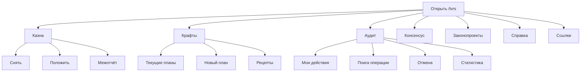

# Универсалитет Товарищества

**Универсалитет** — это единое меню для всей работы Товарищества. Вместо запоминания множества
команд достаточно ввести `/tvrs` и выбрать нужный раздел кнопкой.

Меню доступно каждому участнику сервера. Ответ видите только вы, поэтому панель не засоряет канал
и никто другой не сможет нажимать её кнопки.

## Два центра бота

| Команда | Что открывает |
|---|---|
| `/tvrs` | Товарищество: казна, крафты, аудит, статистика, законопроекты, консенсус и ссылки |
| `/sg` | Бюро: дела, сотрудники, реестр и инструменты Бюро |

Эти центры разделены намеренно: `/tvrs` отвечает за общие дела Товарищества, а `/sg` — за работу
Бюро.

## Как открыть меню

1. Введите `/tvrs` в любом серверном канале.
2. Бот покажет вашу личную панель.
3. Нажмите кнопку нужного раздела.
4. Чтобы вернуться, нажмите **«Назад»**.

На главном экране сразу видны:

- примерный остаток казны;
- количество операций после последней сверки;
- число активных планов крафта и рецептов;
- количество ваших активных действий;
- очередь законопроектов;
- состояние текущего консенсуса.

Кнопка **«Обновить»** заново загружает эти данные из журнала.

## Карта Универсалитета

## Казна

Кнопка **«Казна»** открывает актуальный расчётный остаток и три действия:

| Кнопка | Когда использовать |
|---|---|
| **«Снял»** | Вы взяли деньги из казны |
| **«Положил»** | Вы добавили деньги в казну |
| **«Межотчёт»** | Нужно записать фактическую сумму и исправить расхождение |

Для снятия и пополнения укажите сумму, развёрнутую причину и капчу из трёх цифр. После сохранения
бот выдаст код из четырёх букв — перенесите его в причину операции в игре.

> [!IMPORTANT]
> Не создавайте выдуманное снятие или пополнение, чтобы подогнать остаток. Если сумма в игре
> отличается от бота из-за технических расходов, используйте **«Межотчёт»**.

Все операции сохраняются в базе и отправляются ответственному за казну. Публичный финансовый
лог временно отключён до утверждения правил нового канала; операционный центр получает только
задачи, а не каждую запись движения денег.

Подробно: [Финансы Товарищества](finance.md).

## Крафты

Кнопка **«Крафты»** открывает производственный центр:

| Кнопка | Что делает |
|---|---|
| **«Текущие крафты»** | Показывает все незавершённые планы |
| **«Новый план»** | Позволяет выбрать рецепт, объём и ответственного |
| **«Рецепты»** | Открывает просмотр, добавление и управление рецептами |

Новую карточку плана бот всегда публикует в операционном центре **«Активные задачи»**, даже если `/tvrs` был открыт в
другом канале. Дальнейшая работа продолжается на общей карточке: закупка, постановка циклов,
сверка склада, маркет и продажи.

Подробно: [Крафты Товарищества](craft.md).

## Аудит и исправление ошибок

Кнопка **«Аудит»** собирает контрольные инструменты в одном месте:

- **«Мои действия»** показывает последние записи и их ID;
- **«Найти операцию»** ищет финансовую запись по коду, типу, периоду, автору или причине;
- **«Отменить»** отменяет ваше последнее действие либо действие с точным ID;
- **«Статистика казны»** показывает финансовые итоги за 30 дней;
- **«Статистика крафтов»** показывает производственные итоги за 30 дней.

Отмена не стирает историю. Исходная запись остаётся в журнале, а бот создаёт прозрачную
компенсацию с автором и причиной.

Если у действия есть более позднее зависимое действие, бот не даст нарушить цепочку и подскажет,
что нужно отменить сначала. Чужие действия может отменять только финансовый администратор или
администратор сервера.

Подробно: [Журнал действий и аудит](audit.md).

## Законопроекты

Кнопка **«Законопроекты»** показывает очередь материалов и даёт быстрый переход в штатный канал
подачи. Просматривать очередь могут все участники.

Сама подача и дальнейшее рассмотрение продолжают работать в установленном канале, поэтому
общая история не распадается по разным местам.

## Консенсус

Кнопка **«Консенсус»** открывает пленарную панель: очередь, подготовку и управление заседанием.

> [!NOTE]
> Управлять консенсусом могут только председатели. Если у вас нет нужной роли, бот спокойно
> сообщит об ограничении; казна, крафты, аудит и законопроекты останутся доступны.

## Ссылки

Кнопка **«Ссылки»** открывает два быстрых перехода: доступ к Discord Бюро и заявку в
Товарищество. Ссылки находятся внутри приватной панели и не публикуются в текущем канале.

## Старые команды никуда не исчезли

Универсалитет — основной удобный вход, но быстрые команды продолжают работать:

| Команда | Быстрый переход |
|---|---|
| `/finance` | Казна в канале «Активные задачи» |
| `/craft` | Крафты в канале «Активные задачи» |
| `/actions` | Журнал действий |
| `/undo` | Отмена действия |
| `/finance-audit` | Поиск финансовых операций |
| `/finance-stats` | Статистика казны |
| `/craft-stats` | Статистика крафтов |

## Если что-то пошло не так

### Панель устарела

Нажмите **«Обновить»** или снова введите `/tvrs`.

### Другой человек не может нажать кнопки моего меню

Так и должно быть. Каждая панель приватна и закреплена за тем, кто её открыл.

### Карточка крафта появилась не в текущем канале

Это штатное поведение. Все общие карточки создаются в операционном центре, чтобы участники видели одну
актуальную версию плана.

### Я ошибся в сумме или количестве

Откройте **«Аудит»** → **«Мои действия»**, найдите ID и нажмите **«Отменить»**. Укажите причину
исправления. Если бот сообщает о зависимой записи, отменяйте цепочку с самого позднего действия.

## Короткая памятка

1. `/tvrs` — вся работа Товарищества.
2. `/sg` — работа Бюро.
3. Меню `/tvrs` приватное, результаты публикуются в правильных общих каналах.
4. Казна — деньги и сверки.
5. Крафты — рецепты и производственные планы.
6. Аудит — поиск, статистика и безопасная отмена.
7. Консенсус управляется только председателями.
