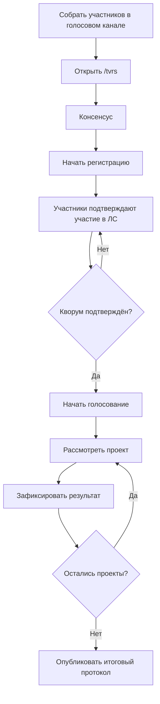

# chair

Эта страница ведёт председателя от подготовки кворума до итогового протокола.

**Доступ:** председатель, постоянный председатель или администратор сервера.

## Весь процесс



## Подготовка

Перед запуском убедитесь:

* в очереди есть хотя бы один законопроект;
* ведущий находится в голосовом канале;
* присутствуют минимум два председателя;
* присутствует нечётное количество сенаторов — минимум один;
* участники могут получать ЛС от бота.

Председатели не считаются сенаторами, даже если у них есть обе роли.

## Запуск регистрации

1. Введите `/tvrs`.
2. Нажмите **«Консенсус»**.
3. Проверьте очередь и номер следующего заседания.
4. Нажмите **«Начать консенсус»**.

Бот автоматически зарегистрирует ведущего, временно закроет подачу новых проектов и разошлёт остальным приглашения в ЛС.

## Панель регистрации

В панели отображаются:

* ведущий;
* подтверждённые и ожидающие участники;
* роли каждого;
* состояние кворума;
* участники с закрытыми ЛС;
* очередь проектов.

Не начинайте голосование, пока бот не покажет, что подтверждённый кворум собран.

## Начало голосования

Нажмите **«Начать голосование»**. Бот возьмёт первый проект в очереди и разошлёт карточки.

В панели ведущего доступны:

| Кнопка                     | Что делает                               |
| -------------------------- | ---------------------------------------- |
| **За / Против**            | Записывает голос ведущего                |
| **Завершить голосование**  | Подводит итог по уже поданным голосам    |
| **30 сек / 1 / 3 / 5 мин** | Запускает или заменяет таймер            |
| **Пауза**                  | Временно останавливает процесс           |
| **Вето!**                  | Доступно только постоянному председателю |

## Когда завершать голосование

Голосование закончится одним из способов:

* проголосовали все подтверждённые участники;
* закончился таймер;
* ведущий нажал **«Завершить голосование»**;
* постоянный председатель подтвердил вето.

После результата выберите **«Следующий проект»**. Если очередь пуста, завершите консенсус.

## Дискуссия

Когда сенатор запрашивает дискуссию, бот останавливает таймер и создаёт отдельное пространство для материалов. Следите за поступающими позициями и завершайте дискуссию только после того, как стороны успели высказаться.

После кнопки **«Завершить дискуссию»** голосование возобновится с сохранёнными голосами.

## Пауза и потеря кворума

Пауза может быть ручной или автоматической. При выходе участников бот проверяет, остались ли в голосовом канале два председателя и нечётное число сенаторов.

Чтобы продолжить:

1. Верните нужных участников в голосовой канал.
2. Нажмите **«Продолжить»**.
3. Дождитесь повторной проверки кворума.

Если продолжение невозможно, завершите консенсус. Незавершённый текущий проект вернётся в очередь, а уже опубликованные результаты сохранятся.

## Завершение заседания

После последнего проекта бот:

* завершит активную сессию;
* опубликует итоговый протокол;
* отправит итог участникам;
* увеличит номер следующего консенсуса;
* восстановит карточку подачи законопроектов.

Проверьте публичный протокол: число рассмотренных, принятых, отклонённых и отправленных на повторное рассмотрение проектов.


Не перезапускайте бот во время активного консенсуса. Текущая live-сессия, таймер и активные кнопки не восстанавливаются после перезапуска; сохранённые проекты останутся, но заседание придётся начать заново.


## Чек-лист ведущего

```
□ Очередь проверена
□ Ведущий в голосовом канале
□ 2+ председателя
□ Нечётное число сенаторов
□ Участники подтвердились в ЛС
□ Перед каждым итогом проверен таймер и ожидающие голоса
□ После последнего проекта опубликован протокол
```
