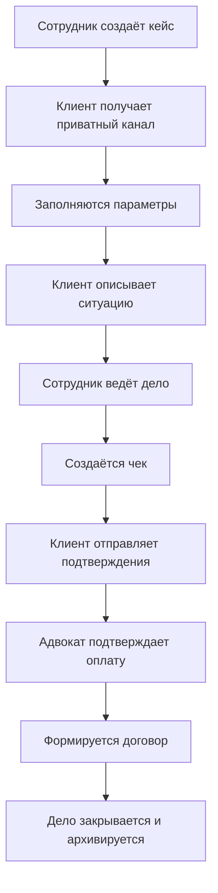

# overview

SGL Bureau помогает вести клиентские обращения в одном приватном пространстве: от первого описания ситуации до оплаты, договора, результата и архива.

Главная команда Бюро — `/sg`.

## Кому доступна система

| Участник        | Что может делать                                                      |
| --------------- | --------------------------------------------------------------------- |
| Клиент          | Видеть свой канал, заполнять данные и отправлять подтверждения оплаты |
| Ведущий адвокат | Полностью вести кейс, оформлять чек, договор и закрытие               |
| Секретарь       | Помогать с кейсом и его завершением                                   |
| Сотрудник SGL   | Работать с центральной панелью, реестрами и делами                    |
| Администратор   | Выполнять служебные и исправляющие действия                           |

## Где открывать `/sg`

Поведение команды зависит от места.

### В командном центре Бюро

`/sg` открывает приватную центральную панель со статистикой, расценками, реестрами и редактором.

Сотрудник также может сразу найти нужное:

```
/sg user:@Клиент
/sg case:90
```

### В канале кейса

`/sg` открывает панель именно этого дела. Бот понимает номер по каналу, поэтому вводить его повторно не нужно.

## Что есть в центральной панели

| Раздел       | Для чего                          |
| ------------ | --------------------------------- |
| **Расценки** | Посмотреть услуги и пошлины       |
| **Реестр**   | Найти клиента или адвоката        |
| **Редактор** | Открыть служебную карточку записи |
| **Обновить** | Загрузить актуальную статистику   |
| **Выход**    | Закрыть приватную панель          |

## Что есть в панели кейса

Набор кнопок адаптируется к состоянию дела:

* **«Параметры»** — сведения клиента и тип обращения;
* **«Добавить ссылку»** — ссылка на иск или заявление;
* **«Создать чек»** — стоимость услуг и пошлина;
* **«Договор»** — формирование документов;
* **«Закрыть кейс»** — итог и, при необходимости, портфолио;
* **«Редактировать»** — исправление данных сотрудником;
* **«Обновить»** — актуальная карточка;
* **«Открыть канал»** и **«Открыть иск»** — быстрые ссылки.

Кнопки, которые ещё не подходят текущему этапу, могут быть недоступны.

## Как читать название канала

| Значок  | Состояние дела                                             |
| ------- | ---------------------------------------------------------- |
| `⏳`     | Обязательные данные или описание ситуации ещё не заполнены |
| `👀`    | Данные готовы, но ссылки на иск ещё нет                    |
| `🧘‍♂️` | Иск добавлен, дело ведётся                                 |
| `✋`     | Дело закрыто                                               |

После подтверждения оплаты к названию может добавиться юрисдикция, например `DC`, `SC` или `AC`.

## Путь клиента


