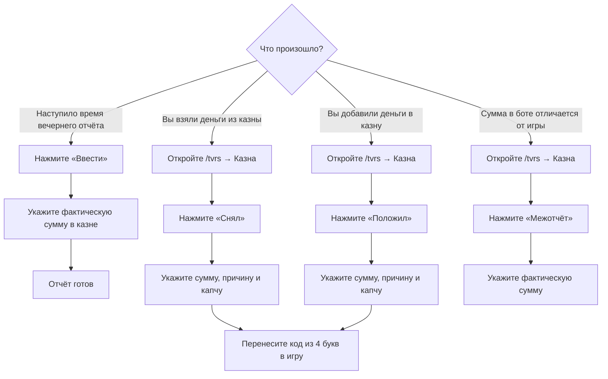

# finance

Система финансов помогает участникам следить за казной, отмечать снятие и пополнение денег и регулярно сверять фактический остаток.

Вам не нужно вести расчёты вручную. Достаточно вовремя выбирать нужное действие и указывать правдивую сумму.

## Как всё устроено



## Где пользоваться системой

| Что нужно сделать           | Где это происходит                                                                |
| --------------------------- | --------------------------------------------------------------------------------- |
| Заполнить вечерний отчёт    | Карточка в `#лог-финансы`; ссылка на ожидающую задачу видна в `#активные-задачи`   |
| Снять или положить деньги   | `/tvrs` → **«Казна»** или `/finance` в любом серверном канале                     |
| Провести внеплановую сверку | Кнопка **«Межотчёт»** в разделе казны                                             |

Разделом казны может пользоваться любой участник. Прямая команда `/finance` и универсальное меню `/tvrs` работают в любом серверном канале; ответы панели приватные. История и служебные сообщения казны остаются в `#лог-финансы`.

## Как понимать сумму в панели казны

Панель показывает **примерный остаток** казны.

Он считается так:

```
Последняя проверенная сумма
+ отмеченные пополнения
− отмеченные снятия
= примерный остаток
```

Например:

```
Вечерний отчёт:  10 000 000 $
Положили:           500 000 $
Сняли:              200 000 $

Примерно в казне: 10 300 000 $
```


Сумма называется примерной, потому что игра может списывать деньги на технические расходы. Такие списания бот не видит.


Если сумма в панели отличается от реальной казны, не пытайтесь исправлять разницу выдуманным снятием или пополнением. Используйте **«Межотчёт»**.

## Ежедневный отчёт

Каждый день в `18:00` бот просит участников проверить казну. Исходная интерактивная карточка находится в `#лог-финансы`, а операционный центр показывает на неё ссылку в `#активные-задачи`, пока отчёт не заполнен.

В канале появляется сообщение:

> **🏛️ Ежедневная сверка казны**\
> Настало время зафиксировать фактический остаток казны за сегодняшний день.
>
> **Статус:** 🟡 Ожидает заполнения
>
> Кнопка: `Ввести`

### Кто может заполнить отчёт

Отчёт может заполнить любой участник, который видит сообщение и может проверить фактическую сумму в казне.

Не нужно ждать определённого человека. Если вы уверены в сумме, можете заполнить отчёт самостоятельно.

### Как заполнить




## Проверьте фактическую сумму

Проверьте фактическую сумму казны в игре.




## Нажмите кнопку

Нажмите **«Ввести»** под сообщением бота.




## Впишите сумму

Впишите полную сумму.




## Сравните число

Ещё раз сравните число с игрой.




## Подтвердите форму

Подтвердите форму.



Сумму можно писать разными способами:

```
12500000
12 500 000
12.500.000
12,500,000
```

После заполнения сообщение изменится:

> **✅ Ежедневная сверка казны заполнена**\
> **В казне:** `12 500 000 $`\
> **Заполнил:** @User

Кнопка станет неактивной. Повторно заполнять тот же вечерний отчёт не нужно.


Не вводите приблизительную сумму. Вечерний отчёт должен содержать фактический остаток, который вы видите в игре.


## Панель казны

Откройте `/tvrs` → **«Казна»**. Быстрый вариант — `/finance` в любом серверном канале.

Бот покажет приватную панель:

> **💼 Финансы Товарищества**\
> **Примерно в казне:** `10 300 000 $`\
> **Последняя точная сверка:** `10 000 000 $`\
> **Операций после сверки:** `2`
>
> Кнопки: `Снял` · `Положил` · `Межотчёт`

Панель видна только вам. Остальные участники не увидят её в канале.

## Если вы сняли деньги

Используйте кнопку **«Снял»**, если вы действительно взяли деньги из казны.

### Порядок действий




## Откройте казну

Откройте `/tvrs` → **«Казна»**.




## Нажмите кнопку

Нажмите **«Снял»**.




## Укажите сумму

Укажите сумму снятия.




## Опишите причину

Подробно опишите причину.




## Перепишите капчу

Перепишите три цифры из подсказки в поле капчи.




## Подтвердите форму

Подтвердите форму.




## Получите код

Получите код из четырёх букв.




## Введите код в игру

Введите этот код в причину операции в игре.



### Пример заполнения

```
Сумма
750 000

Подробная причина
Закупка и подготовка транспорта для общего мероприятия Товарищества

Проверка: перепишите 3 цифры
482
```

После подтверждения бот ответит:

> **✅ Операция записана**\
> Зафиксировано снятие на `750 000 $`.
>
> **Код из 4 букв:** `KXRM`

В игре причина может выглядеть так:

```
KXRM
```

Если игра позволяет написать более длинную причину, код всё равно должен присутствовать в ней без изменений.

## Если вы положили деньги

Используйте кнопку **«Положил»**, если вы добавили деньги в казну.

Порядок действий такой же:




## Откройте казну

Откройте `/tvrs` → **«Казна»**.




## Нажмите кнопку

Нажмите **«Положил»**.




## Укажите сумму

Укажите внесённую сумму.




## Опишите источник денег

Подробно опишите источник денег.




## Введите капчу

Введите капчу из трёх цифр.




## Подтвердите форму

Подтвердите форму.




## Получите код

Перенесите полученный четырёхбуквенный код в причину операции в игре.



Пример причины:

```
Поступление членских взносов за текущий период от трёх участников
```

После операции примерный остаток в панели казны увеличится.

## Как правильно писать причину

Причина должна помогать другому участнику понять, куда ушли деньги или откуда они появились.

### Хорошие причины

```
Закупка двух автомобилей для мероприятия 14 июля

Возврат остатка после организации общего собрания

Поступление членских взносов от участников за июль

Оплата материалов для оформления офиса Товарищества
```

### Плохие причины

```
надо

машина

расходы

потом объясню
```

Плохая причина не объясняет назначение операции и затрудняет последующую проверку.


Хорошая причина отвечает минимум на два вопроса: **для чего** нужны деньги и **с чем связана** операция.


## Капча из трёх цифр

При снятии и пополнении в последнем поле формы показываются три цифры.

Например:

```
Проверка: перепишите 3 цифры
Код: 482
```

В поле нужно написать:

```
482
```

Капча защищает от случайного подтверждения формы.

Если цифры введены неверно:

* операция не сохраняется;
* деньги в расчёте не изменяются;
* нужно снова нажать **«Снял»** или **«Положил»**;
* в новой форме будет другая капча.

## Код из четырёх букв

После успешного снятия или пополнения бот выдаёт случайный код:

```
KXRM
```

Этот код необходимо перенести в причину операции в игре. Он нужен для связи игровой операции с записью в Discord.

Правила:

* используйте именно тот код, который выдал бот;
* не меняйте порядок букв;
* не используйте код от старой операции;
* не закрывайте ответ бота, пока не перенесёте код в игру;
* для каждой операции создаётся новый код.


Если вы подтвердили форму, но не провели операцию в игре, сразу сообщите ответственному за казну. Не создавайте обратную фиктивную операцию без согласования.


## Межотчёт

**Межотчёт** — это внеплановая проверка фактической суммы в казне.

Он нужен, если:

* сумма в панели казны отличается от суммы в игре;
* после технических расходов расчёт устарел;
* необходимо проверить казну до вечернего отчёта;
* ответственному участнику нужна точная сумма прямо сейчас.

### Как провести межотчёт




## Проверьте сумму в игре

Проверьте фактическую сумму в игре.




## Откройте казну

Откройте `/tvrs` → **«Казна»**.




## Нажмите кнопку

Нажмите **«Межотчёт»**.




## Укажите сумму

Укажите фактическую сумму.




## Сравните число

Проверьте число ещё раз.




## Подтвердите форму

Подтвердите форму.



После межотчёта указанная сумма становится новой точной суммой. Все последующие снятия и пополнения будут считаться уже от неё.

Капча и код из четырёх букв для межотчёта не нужны, потому что вы не перемещаете деньги, а только сверяете остаток.

## Как выбрать нужную кнопку

| Ситуация                                 | Что нажать                              |
| ---------------------------------------- | --------------------------------------- |
| Взяли деньги из казны                    | **«Снял»**                              |
| Добавили деньги в казну                  | **«Положил»**                           |
| Проверили казну и нашли расхождение      | **«Межотчёт»**                          |
| Наступило время ежедневного отчёта       | **«Ввести»** в сообщении отчёта         |
| Только хотите посмотреть примерную сумму | Открыть **«Казну»**, ничего не нажимать |

## Общая отмена действий

Команда `/undo` работает не только с казной. Она умеет безопасно отменять действия в финансах, крафтах, делах бюро и голосованиях.

Каждая важная операция получает отдельный **ID действия**. Бот показывает его после сохранения, например:

```
Действие для отмены: #184
```

Если номер потерялся, введите `/actions`. Бот покажет ваш журнал: что было сделано, когда и можно ли это отменить.

### Отменить последнее своё действие

```
/undo reason:Ошибся в сумме
```

Без `action_id` бот отменяет последнее действующее действие пользователя.

### Отменить конкретное действие

```
/undo action_id:184 reason:Введено неверное количество
```

Так безопаснее, если после ошибки вы успели сделать что-то ещё.

### Отменить действие другого пользователя

Ответственный за казну или администратор сервера может выполнить:

```
/undo user:@Участник reason:Исправление по результатам проверки
```

Либо указать точный `action_id`. Обычный участник может отменять только собственные действия.

### Почему бот иногда просит отменять в обратном порядке

Если более поздняя операция зависит от ранней, бот не позволит нарушить цепочку. Например, нельзя сначала отменить итог производства, если после него уже записаны выставление и продажа.

Бот напишет ID более позднего действия. Отмените его, затем повторите отмену раннего.

### Связь с крафтом

* Снятие, связанное кодом с закупкой, сначала защищено от отдельной отмены. Сначала отмените закупку, затем при необходимости само снятие.
* При отмене производственного цикла бот сам возвращает расчётные материалы и создаёт возврат автоматического расхода казны.
* История не удаляется: первоначальная запись и запись об отмене остаются в журнале.


`/undo` исправляет данные бота, но не выполняет обратное действие в игре. Если деньги, материалы или товар уже физически перемещены, отдельно приведите игровое состояние в соответствие с исправленным журналом.


## Поиск и финансовый аудит

Кнопка **«Найти операцию»** в `/tvrs` → **«Аудит»** и команда `/finance-audit` ищут операции по одному или нескольким признакам:

* четырёхбуквенному коду;
* автору;
* типу записи;
* периоду в днях;
* фрагменту причины.

Самый частый вариант:

```
/finance-audit code:KXRM
```

В результате видно:

* номер финансовой записи;
* сумму, автора и время;
* действует операция или отменена;
* связана ли она с закупкой или циклом крафта;
* ID действия для точечной команды `/undo`;
* сохранённую причину.

Примеры:

```
/finance-audit user:@Участник days:30
/finance-audit kind:withdraw text:автомобиль
/finance-audit kind:undo days:7
```

## Статистика казны

Откройте `/tvrs` → **«Аудит»** → **«Статистика казны»** либо используйте команду:

```
/finance-stats days:30
```

Бот покажет остаток, пополнения, снятия, чистый поток, автоматические расходы крафта, количество сверок и отмен, самых активных участников и крупнейшие назначения денег.

Отменённые операции не входят в итоговые суммы.

## Частые ситуации

<details>

<summary>Я ошибся в капче</summary>

Операция не сохранилась. Откройте форму ещё раз и заполните её заново.

</details>

<details>

<summary>Я ошибся в сумме, но уже подтвердил форму</summary>

Посмотрите ID в ответе бота или через `/actions`, затем выполните `/undo action_id:... reason:...` и внесите правильную запись. Если операция уже проведена в игре, не забудьте отдельно согласовать игровое состояние.

</details>

<details>

<summary>Я получил код, но забыл перенести его в игру</summary>

Найдите приватный ответ бота и перенесите код. Если ответ уже недоступен, обратитесь к ответственному: код присутствует в журнале операции.

</details>

<details>

<summary>Панель показывает не ту сумму</summary>

Сначала сравните её с фактической казной. Если расхождение связано с техническими расходами или неучтёнными изменениями, проведите **межотчёт**.

</details>

<details>

<summary>Кнопка вечернего отчёта неактивна</summary>

Значит, отчёт уже заполнен. Актуальная сумма указана в обновлённом сообщении.

</details>

<details>

<summary>Команда `/finance` не открывается</summary>

Повторите `/finance` либо откройте `/tvrs` → **«Казна»** в любом серверном канале. Если бот не отвечает, проверьте `#лог-тех`.

</details>

<details>

<summary>Я не уверен в сумме вечернего отчёта</summary>

Не заполняйте его приблизительно. Перепроверьте казну или попросите другого участника, который может увидеть фактический остаток.

</details>

## Короткая памятка

```
Взял деньги      → /tvrs → Казна → Снял
Положил деньги   → /tvrs → Казна → Положил
Нашёл расхождение → /tvrs → Казна → Межотчёт
Увидел отчёт в 18:00 → Ввести
Посмотреть свои действия → /actions
Ошибся в последней записи → /undo reason:...
Ошибся в конкретной записи → /undo action_id:... reason:...
Ответственный отменяет чужую запись → /undo user:@Участник
Найти операцию по коду → /finance-audit code:ABCD
Посмотреть итоги месяца → /finance-stats days:30

Для снятия и пополнения:
сумма → подробная причина → капча → код из 4 букв в игру
```

Главное правило системы: **каждое реальное движение денег отмечается сразу, а каждый отчёт содержит фактическую сумму из игры**.
